# System Flow Diagrams

## 1. High-Level Architecture

```mermaid
graph TD
    %% Nodes
    Client[Client Application]

    subgraph API_Service [API Service ASP.NET Core]
        Controller["LookupController<br/>- SubmitLookupJob (use case)<br/>- GetJobStatus (use case)"]
    end

    RabbitMQ{{"RabbitMQ<br/>(Events & Commands)"}}
    Redis[("Redis<br/>(State)")]

    %% Workers
    Saga["Saga (State Machine)"]
    Geo["GeoWorker<br/>(x2)"]
    Ping["PingWorker<br/>(x2)"]
    Rdap["RdapWorker<br/>(x2)"]
    Rdap["ReverseDNS<br/>(x2)"]

    %% External Systems
    ExtIP["ip-api.com"]
    ExtNet["Network Stack"]
    ExtRdap["RDAP Servers"]
    ExtRdns["DNS Servers"]

    %% Connections: Client to API
    Client -->|POST /api/lookup<br/>submit job| Controller
    Client -->|GET /api/lookup/id<br/>poll status| Controller

    %% Connections: API to Infra
    Controller -->|"Publish event"| RabbitMQ
    Controller -->|"Read state"| Redis

    %% Connections: RabbitMQ to Consumers
    RabbitMQ -->|Consume| Saga
    RabbitMQ -->|Consume| Geo
    RabbitMQ -->|Consume| Ping
    RabbitMQ -->|Consume| Rdap
    RabbitMQ -->|Consume| Rdns

    %% Connections: Workers to Targets
    Saga -->|Update| Redis
    Geo -->|"External API"| ExtIP
    Ping -->|ICMP| ExtNet
    Rdap -->|"RDAP API"| ExtRdap
    Rdns -->|"DNS API"| ExtRdns

    %% Styling for better visibility
    classDef storage fill:#eee,stroke:#333,stroke-width:2px;
    class Redis storage;
    classDef queue fill:#f9f,stroke:#333,stroke-width:2px;
    class RabbitMQ queue;
```



## 2. Message Flow (Sequence Diagram)


## 3. Direct Worker Persistence Flow 


## 4. Worker Base Class Pattern 


## 5. Polymorphic Storage Architecture 


## 6. Storage Abstraction Flow 


## 7. State Machine (Saga)


## 8. Worker Processing Flow


## 9. Data Storage Model

### Redis Key Structure

```
lookup:job:{jobId}
├─ jobId: string
├─ target: string
├─ targetType: enum
├─ status: enum (Pending/Processing/Completed/Failed)
├─ createdAt: datetime
├─ completedAt: datetime?
├─ requestedServices: ServiceType[]
└─ results: ServiceResult[]
   ├─ serviceType: enum
   ├─ success: bool
   ├─ data: json
   ├─ errorMessage: string?
   ├─ completedAt: datetime
   └─ durationMs: int

saga:{jobId}
├─ correlationId: guid
├─ currentState: string
├─ pendingServices: ServiceType[]
└─ completedServices: ServiceType[]

result:{jobId}:{serviceType}  
├─ data: json (actual result data)
└─ ttl: 3600 seconds
```

## 10. Scaling Model


## 11. Failure Scenarios

### Scenario A: Worker Crashes Mid-Process


### Scenario B: External API Times Out


### Scenario C: Redis Crashes


## 12. Extension Points


## 13. Monitoring Points

```
┌─────────────────────────────────────────────┐
│              Metrics to Track               │
├─────────────────────────────────────────────┤
│ API:                                        │
│  - Requests/sec                             │
│  - P50/P95/P99 latency                      │
│  - Error rate                               │
│                                             │
│ RabbitMQ:                                   │
│  - Queue depth                              │
│  - Message rate (in/out)                    │
│  - Consumer count                           │
│                                             │
│ Workers:                                    │
│  - Processing time per service              │
│  - Success/failure rate                     │
│  - Active worker count                      │
│  - Storage backend latency                │
│                                             │
│ Redis:                                      │
│  - Hit rate                                 │
│  - Memory usage                             │
│  - Key count                                │
│                                             │
│ Saga:                                       │
│  - Jobs in flight                           │
│  - Average completion time                  │
│  - State transition errors                  │
│                                             │
│ Storage Layer:                            │
│  - Write latency (p50/p95/p99)              │
│  - Backend distribution (Redis/S3/etc)      │
│  - ResultLocation types in use              │
└─────────────────────────────────────────────┘
```

---

## Architecture Highlights 

### Template Method Pattern Benefits

**Before (Each worker ~150 lines):**
- Duplicated timing code
- Duplicated validation
- Duplicated persistence logic
- Duplicated error handling
- Inconsistent patterns

**After (Each worker ~30 lines):**
- Single source of truth
- Guaranteed consistency
- Trivial to add new services
- 90% code reduction

### Storage Abstraction Benefits

**Current State:**
- Redis for all results
- Fast but limited by memory
- Single storage type

**Future Ready:**
- Small results → Redis (fast)
- Large results → S3 (cheap)
- Structured data → DynamoDB
- No worker code changes needed

---

These diagrams illustrate the **distributed, asynchronous, fault-tolerant** nature of the system. Each component is independently scalable and resilient to failures. The new worker base class pattern and storage abstraction layer demonstrate production-ready design patterns that eliminate duplication and enable future extensibility.