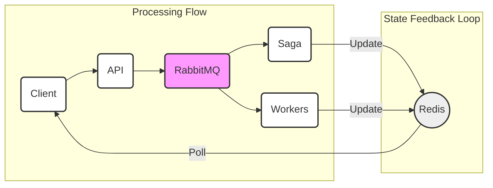

# Quick Start Guide

Get the Distributed Lookup System running in under 5 minutes.

## Prerequisites

- Docker Desktop installed and running
- (Optional) `curl` and `jq` for testing

## Step 1: Start the System

```bash
# Clone/navigate to the project directory
cd DistributedLookup

# Start all services (API + Workers + RabbitMQ + Redis)
docker-compose up --build
```

**Expected Output:**
```
Creating distributed-lookup-redis    ... done
Creating distributed-lookup-rabbitmq ... done
Creating distributed-lookup-api      ... done
Creating distributed-lookup-geo-worker-1 ... done
Creating distributed-lookup-ping-worker-1 ... done
Creating distributed-lookup-rdap-worker-1 ... done
Creating distributed-lookup-reversedns-worker-1 ... done
```

Wait for all services to start (~30 seconds on first build).

## Step 2: Submit Your First Job

**Using curl:**
```bash
curl -X POST http://localhost:8080/api/lookup \
  -H "Content-Type: application/json" \
  -d '{"target": "8.8.8.8"}'
```

**Expected Response:**
```json
{
  "jobId": "a1b2c3d4-e5f6-7890-abcd-ef1234567890",
  "statusUrl": "/api/lookup/a1b2c3d4-e5f6-7890-abcd-ef1234567890",
  "message": "Job submitted successfully. Poll the status URL to check progress."
}
```

**Copy the `jobId` for the next step.**

## Step 3: Check Job Status

```bash
# Replace {jobId} with your actual job ID
curl http://localhost:8080/api/lookup/{jobId}
```

**Expected Response (Processing):**
```json
{
  "jobId": "a1b2c3d4-e5f6-7890-abcd-ef1234567890",
  "target": "8.8.8.8",
  "targetType": "IPAddress",
  "status": "Processing",
  "completionPercentage": 75,
  "requestedServices": [0, 1, 2, 3],
  "results": [
    {
      "serviceType": "0",
      "success": true,
      "data": "{\"country\":\"US\",\"city\":\"Mountain View\"...}",
      "completedAt": "2024-01-15T10:30:45Z",
      "durationMs": 234
    }
  ]
}
```

**Wait 3-5 seconds and check again for completed status.**

## Step 4: View Full Results

Once `"status": "Completed"` and `"completionPercentage": 100`:

```bash
curl http://localhost:8080/api/lookup/{jobId} | jq '.'
```

**Sample Complete Response:**
```json
{
  "jobId": "a1b2c3d4-e5f6-7890-abcd-ef1234567890",
  "target": "8.8.8.8",
  "status": "Completed",
  "completionPercentage": 100,
  "results": [
    {
      "serviceType": "0",
      "success": true,
      "data": {
        "country": "United States",
        "city": "Mountain View",
        "isp": "Google LLC",
        "lat": 37.4056,
        "lon": -122.0775
      }
    },
    {
      "serviceType": "1",
      "success": true,
      "data": {
        "packetsReceived": 4,
        "averageRoundtripMs": 15.2,
        "packetLoss": 0
      }
    },
    {
      "serviceType": "2",
      "success": true,
      "data": {
        "handle": "NET-8-8-8-0-1",
        "name": "LVLT-GOGL-8-8-8"
      }
    },
    {
      "serviceType": "3",
      "success": true,
      "data": {
        "hostName": "dns.google",
        "found": true
      }
    }
  ]
}
```

## Step 5: Try More Examples

**Domain lookup:**
```bash
curl -X POST http://localhost:8080/api/lookup \
  -H "Content-Type: application/json" \
  -d '{"target": "google.com"}'
```

**Custom services:**
```bash
curl -X POST http://localhost:8080/api/lookup \
  -H "Content-Type: application/json" \
  -d '{
    "target": "1.1.1.1",
    "services": [0, 1]
  }'
```

**List available services:**
```bash
curl http://localhost:8080/api/lookup/services | jq '.'
```

## Step 6: Run Automated Tests

```bash
# Make script executable (if not already)
chmod +x test-api.sh

# Run tests
./test-api.sh
```

This will:
1. Submit multiple jobs
2. Check their status
3. Display results

## Monitoring & Debugging

### RabbitMQ Management UI

- URL: http://localhost:15672
- Username: `guest`
- Password: `guest`

**What to see:**
- Queues: `geoip-queue`, `ping-queue`, `rdap-queue`, `reversedns-queue`, `lookup-saga`
- Messages flowing through queues
- Worker connections

### Redis CLI

```bash
# Connect to Redis
docker exec -it distributed-lookup-redis redis-cli

# View all job keys
KEYS lookup:job:*

# Get a specific job
GET lookup:job:{your-job-id}

# View saga state
KEYS saga:*
```

### View Logs

**API logs:**
```bash
docker logs -f distributed-lookup-api
```

**Worker logs:**
```bash
docker logs -f distributed-lookup-geo-worker-1
docker logs -f distributed-lookup-ping-worker-1
```

### Health Checks

**Check API readiness:**
```bash
curl http://localhost:8080/health/ready
```

**Check API liveness:**
```bash
curl http://localhost:8080/health/live
```

## Stopping the System

```bash
# Stop all containers
docker-compose down

# Stop and remove volumes (clean state)
docker-compose down -v
```

## Scaling Workers

Want more throughput? Scale workers independently:

```bash
# Scale GeoIP workers to 5 instances
docker-compose up --scale geo-worker=5

# Scale all workers
docker-compose up --scale geo-worker=3 --scale ping-worker=3 --scale rdap-worker=3 --scale reversedns-worker=3
```

Watch RabbitMQ management UI to see load balancing across workers!

## Troubleshooting

### API not responding?

```bash
# Check if containers are running
docker ps

# View API logs
docker logs distributed-lookup-api
```

### Workers not processing?

```bash
# Check RabbitMQ is healthy
docker logs distributed-lookup-rabbitmq

# Verify worker connections in RabbitMQ UI
# http://localhost:15672 → Connections
```

### Redis connection issues?

```bash
# Test Redis
docker exec distributed-lookup-redis redis-cli ping
# Should return: PONG
```

## What's Happening Under the Hood?

1. **Submit Job** → API creates job in Redis, publishes `JobSubmitted` event
2. **Saga Receives Event** → Dispatches commands to worker queues
3. **Workers Process** → Each worker consumes its command, performs lookup, publishes `TaskCompleted`
4. **Saga Aggregates** → Collects all results, updates job in Redis
5. **Poll Status** → API reads current state from Redis



## Next Steps

- Read [ARCHITECTURE.md](ARCHITECTURE.md) for design decisions
- Read [README.md](README.md) for full documentation
- Explore the code in `src/`

## Common API Usage Patterns

### Pattern 1: Fire and Forget
```bash
# Submit job, save jobId, check later
JOB_ID=$(curl -s -X POST http://localhost:8080/api/lookup \
  -H "Content-Type: application/json" \
  -d '{"target": "8.8.8.8"}' | jq -r '.jobId')

echo "Job submitted: $JOB_ID"
```

### Pattern 2: Poll Until Complete
```bash
while true; do
  STATUS=$(curl -s http://localhost:8080/api/lookup/$JOB_ID | jq -r '.status')
  echo "Status: $STATUS"
  
  if [ "$STATUS" = "Completed" ] || [ "$STATUS" = "Failed" ]; then
    curl -s http://localhost:8080/api/lookup/$JOB_ID | jq '.'
    break
  fi
  
  sleep 1
done
```

### Pattern 3: Batch Submission
```bash
# Submit multiple jobs in parallel
for IP in 8.8.8.8 1.1.1.1 9.9.9.9; do
  curl -s -X POST http://localhost:8080/api/lookup \
    -H "Content-Type: application/json" \
    -d "{\"target\": \"$IP\"}" &
done
wait

echo "All jobs submitted!"
```

---

**That's it! You now have a fully functional distributed system running on your machine.**

Questions? Check the [README.md](README.md) or [ARCHITECTURE.md](ARCHITECTURE.md).