# Distributed Lookup System

A production-quality distributed scatter-gather system for aggregating network information from multiple sources (GeoIP, Ping, RDAP, ReverseDNS) using asynchronous worker orchestration.

## 🏗️ Architecture

### Pattern: Asynchronous Scatter-Gather with Saga Orchestration


### Key Design Decisions

1. **Non-Blocking API**: Returns `202 Accepted` immediately with a job ID
2. **Polling Model**: Clients poll GET `/api/lookup/{jobId}` for status
3. **Saga Pattern**: Central state machine orchestrates the distributed workflow
4. **Worker Isolation**: Each service type has dedicated worker processes
5. **Horizontal Scalability**: Workers can be scaled independently

### Technology Stack

- **.NET 8**: Modern C# with minimal APIs and top-level statements
- **MassTransit**: Message bus abstraction over RabbitMQ
- **RabbitMQ**: Reliable message broker for command/event routing
- **Redis**: Fast, volatile state storage for jobs and saga state
- **Docker Compose**: Multi-container orchestration

### Clean Architecture Layers

```mermaid
block-beta
    columns 2
    %% -- Configure the columns --
    %% Column 1: The Layer Box
    %% Column 2: The Annotation (Arrows)
    
    %% Row 1
    L1["API Layer"]         Note1["← REST endpoints"]
    
    %% Row 2
    L2["Application Layer"] Note2["← Use cases, Saga"]
    
    %% Row 3
    L3["Infra Layer"]       Note3["← Redis, MassTransit"]
    
    %% Row 4
    L4["Domain Layer"]      Note4["← Core entities (no deps)"]
    
    %% Row 5
    L5["Contracts Layer"]   Note5["← Shared messages"]

    %% Spacer rows
    space:2

    %% -- Workers Section --
    %% We create a block that spans both columns (:2)
    block:WorkersGroup:2
        %% Header Text
        WLabel["Workers (separate processes)"]
        
        %% The 4 workers in a row
        block:WList
            columns 4
            Geo Ping RDAP ReverseDNS
        end
    end

    %% Styling to make the 'Notes' look like text (transparent)
    style Note1 fill:none,stroke:none
    style Note2 fill:none,stroke:none
    style Note3 fill:none,stroke:none
    style Note4 fill:none,stroke:none
    style Note5 fill:none,stroke:none
    style WLabel fill:none,stroke:none
```



## 🚀 Getting Started

### Prerequisites

- Docker & Docker Compose
- .NET 8 SDK (for local development)

### Quick Start

```bash
# Clone the repository
git clone <repository-url>
cd DistributedLookup

# Start all services
docker-compose up --build

# API will be available at http://localhost:8080
# RabbitMQ management UI at http://localhost:15672 (guest/guest)
```

### Submit a Lookup Request

```bash
# Basic request (uses default services: GeoIP, Ping, RDAP, ReverseDNS)
curl -X POST http://localhost:8080/api/lookup \
  -H "Content-Type: application/json" \
  -d '{"target": "8.8.8.8"}'

# Response:
{
  "jobId": "123e4567-e89b-12d3-a456-426614174000",
  "statusUrl": "/api/lookup/123e4567-e89b-12d3-a456-426614174000",
  "message": "Job submitted successfully. Poll the status URL to check progress."
}

# Custom services
curl -X POST http://localhost:8080/api/lookup \
  -H "Content-Type: application/json" \
  -d '{
    "target": "google.com",
    "services": [0, 1]
  }'
```

### Check Job Status

```bash
# Poll for results
curl http://localhost:8080/api/lookup/123e4567-e89b-12d3-a456-426614174000

# Response (in progress):
{
  "jobId": "123e4567-e89b-12d3-a456-426614174000",
  "target": "8.8.8.8",
  "targetType": "IPAddress",
  "status": "Processing",
  "completionPercentage": 75,
  "requestedServices": [0, 1, 2, 3],
  "results": [
    {
      "serviceType": "0",
      "success": true,
      "data": "{\"country\":\"US\",\"city\":\"Mountain View\"...}",
      "durationMs": 234
    },
    {
      "serviceType": "1",
      "success": true,
      "data": "{\"averageRoundtripMs\":15.2...}",
      "durationMs": 2045
    },
    {
      "serviceType": "2",
      "success": true,
      "data": "{\"handle\":\"NET-8-8-8-0-1\"...}",
      "durationMs": 567
    }
  ]
}
```

### Available Services

```bash
curl http://localhost:8080/api/lookup/services

# Response:
[
  {
    "name": "GeoIP",
    "value": 0,
    "description": "Geographic location and ISP information"
  },
  {
    "name": "Ping",
    "value": 1,
    "description": "Network reachability and latency check"
  },
  {
    "name": "RDAP",
    "value": 2,
    "description": "Registration data via RDAP protocol"
  },
  {
    "name": "ReverseDNS",
    "value": 3,
    "description": "Reverse DNS lookup (PTR record)"
  }
]
```

## 🔄 Data Flow

### 1. Job Submission (Scatter Phase)

```
Client → API: POST /api/lookup
API → Redis: Save job (status: Pending)
API → RabbitMQ: Publish JobSubmitted event
API → Client: 202 Accepted + JobId
```

### 2. Saga Orchestration

```
Saga ← RabbitMQ: Consume JobSubmitted
Saga → RabbitMQ: Publish CheckGeoIP command
Saga → RabbitMQ: Publish CheckPing command
Saga → RabbitMQ: Publish CheckRDAP command
```

### 3. Worker Processing (UPDATED)

```
Worker ← RabbitMQ: Consume command
Worker → External API: Query service
Worker → IWorkerResultStore: Save result (get ResultLocation)
Worker → RabbitMQ: Publish TaskCompleted(with ResultLocation, not data)
```

**Key Change**: Workers save results directly to storage BEFORE publishing events. Events contain only metadata (ResultLocation), not the actual result data. This reduces message size and improves saga performance.

### 4. Result Aggregation (Gather Phase)

```
Saga ← RabbitMQ: Consume TaskCompleted
Saga → Redis: Update job with result
[When all tasks complete]
Saga → Redis: Mark job as Completed
```

### 5. Status Polling

```
Client → API: GET /api/lookup/{jobId}
API → Redis: Fetch job state
API → Client: Current status + results
```

## 🧪 Testing

### Run Unit Tests

```bash
dotnet test tests/Tests/Tests.csproj
```

### Test Coverage

- ✅ Domain entity logic (state transitions, validation)
- ✅ Use case orchestration (mocked infrastructure)
- 🔄 Integration tests (Testcontainers) - *Next step*

### Example Test

```csharp
[Fact]
public void AddResult_WhenAllServicesComplete_ShouldMarkAsCompleted()
{
    // Arrange
    var services = new[] { ServiceType.GeoIP, ServiceType.Ping };
    var job = CreateTestJob(services);
    
    // Act
    job.AddResult(ServiceType.GeoIP, successResult);
    job.AddResult(ServiceType.Ping, successResult);

    // Assert
    job.Status.Should().Be(JobStatus.Completed);
    job.IsComplete().Should().BeTrue();
}
```

## 📊 Monitoring

### RabbitMQ Management UI

- URL: http://localhost:15672
- Credentials: guest/guest
- View queues, message rates, consumer connections

### Redis CLI

```bash
docker exec -it distributed-lookup-redis redis-cli

# View all jobs
KEYS job:*

# Get job details
GET job:123e4567-e89b-12d3-a456-426614174000

# View all saga states
KEYS saga:*
```

### Inspect Saga State

```bash
# Get saga instance
GET saga:123e4567-e89b-12d3-a456-426614174000

# Response shows:
{
  "JobId": "123e4567-e89b-12d3-a456-426614174000",
  "CurrentState": "Processing",
  "RequestedServices": [0, 1, 2, 3],
  "CompletedTasks": [0, 1],
  "Results": [...]
}
```

## 🛡️ Rate Limiting & Health Checks

### Rate Limiting Policies

The API implements three-tier rate limiting to prevent abuse:

**1. API Limit** (Status checks and general endpoints)
- 100 requests per minute per client
- Fixed window strategy
- Queue limit: 10 requests

**2. Expensive Operations** (Job submissions)
- 20 requests per minute per client
- Sliding window strategy (6 segments)
- Queue limit: 5 requests

**3. Global Limit**
- 1000 requests per minute across all clients
- Prevents total system overload

**Rate Limit Response:**
```json
HTTP/1.1 429 Too Many Requests
Retry-After: 60

{
  "error": "Rate limit exceeded",
  "message": "Too many requests. Please try again later.",
  "retryAfter": 60
}
```

### Health Check Endpoints

**Readiness Check** (`/health/ready`)
- Checks if the API is ready to serve requests
- Validates RabbitMQ connection
- Validates MassTransit bus readiness
- Used by Docker health checks

```bash
curl http://localhost:8080/health/ready
```

**Liveness Check** (`/health/live`)
- Basic health check (process is running)
- Used for container orchestration

```bash
curl http://localhost:8080/health/live
```

Both health endpoints bypass rate limiting.

## 🎯 Design Highlights

### 1. Domain-Driven Design

- **Aggregate Root**: `LookupJob` encapsulates all business logic
- **Value Objects**: `ServiceResult` is immutable
- **Rich Domain Model**: State transitions enforced by entity methods

```csharp
// Invalid state transitions throw exceptions
job.MarkAsProcessing();  // OK if Pending
job.MarkAsProcessing();  // Throws: already Processing
```

### 2. CQRS Pattern

- **Commands**: `SubmitLookupJob` (write operation)
- **Queries**: `GetJobStatus` (read operation)
- Separate read/write concerns for scalability

### 3. Saga Pattern (Orchestration)

```csharp
Initially(
    When(JobSubmitted)
        .PublishAsync(context => DispatchCommands(context))
        .TransitionTo(Processing)
);

During(Processing,
    When(TaskCompleted)
        .ThenAsync(async context => UpdateJob(context))
        .If(AllTasksComplete, 
            binder => binder.TransitionTo(Completed).Finalize())
);
```

### 4. Worker Isolation

Each worker is:
- ✅ Stateless (no shared memory)
- ✅ Independently scalable
- ✅ Fault-tolerant (retries via RabbitMQ)
- ✅ Technology-agnostic (could be rewritten in Go, Python, etc.)

### 5. Repository Pattern

```csharp
public interface IJobRepository
{
    Task<LookupJob?> GetByIdAsync(string jobId);
    Task SaveAsync(LookupJob job);
}
```

Infrastructure dependency injection:
```csharp
builder.Services.AddScoped<IJobRepository, RedisJobRepository>();
```

### 6. Template Method Pattern (Worker Base Class)

All workers inherit from `LookupWorkerBase<TCommand>`, providing:
- ✅ **Consistent Workflow**: Timing, validation, persistence, event publishing
- ✅ **DRY Principle**: 90% reduction in worker code
- ✅ **Easy Extension**: New workers only implement lookup logic

```csharp
// Adding a new worker is simple
public sealed class WhoisConsumer(ILogger logger, IWorkerResultStore store) 
    : LookupWorkerBase<CheckWhois>(logger, store)
{
    protected override ServiceType ServiceType => ServiceType.Whois;
    
    protected override async Task<object> PerformLookupAsync(CheckWhois cmd, CancellationToken ct)
    {
        // Only implement the lookup - base class handles everything else
        return await PerformWhoisLookup(cmd.Target);
    }
}
```

**Worker Implementation Comparison:**

| Aspect | Before | After |
|--------|--------|-------|
| Lines of code | ~150 lines | ~30 lines |
| Duplication | High | None |
| Consistency | Manual | Enforced |
| Extension | Complex | Trivial |

### 7. Storage Abstraction Layer

Workers use `IWorkerResultStore` for result persistence:
- ✅ **Polyglot Persistence Ready**: Support multiple storage backends
- ✅ **Type-Safe Locations**: Polymorphic `ResultLocation` hierarchy
- ✅ **Decoupled**: Workers don't know about saga state

**Current**: Redis implementation  
**Future Ready**: S3, DynamoDB, Azure Blob, FileSystem

```csharp
// ResultLocation uses JSON polymorphism
[JsonPolymorphic]
[JsonDerivedType(typeof(RedisResultLocation), "redis")]
[JsonDerivedType(typeof(S3ResultLocation), "s3")]
[JsonDerivedType(typeof(DynamoDBResultLocation), "dynamodb")]
[JsonDerivedType(typeof(FileSystemResultLocation), "filesystem")]
[JsonDerivedType(typeof(AzureBlobResultLocation), "azureblob")]
public abstract record ResultLocation
{
    public abstract StorageType StorageType { get; }
}
```

**Storage Strategy Examples:**

```csharp
// Small results → Redis (fast, in-memory)
public record RedisResultLocation(string Key, int Database, TimeSpan? Ttl) 
    : ResultLocation
{
    public override StorageType StorageType => StorageType.Redis;
}

// Large results → S3 (cheap, durable)
public record S3ResultLocation(string Bucket, string Key, string? PresignedUrl) 
    : ResultLocation
{
    public override StorageType StorageType => StorageType.S3;
}
```

## 🚧 Production Considerations & Next Steps

### Already Implemented ✅

1. **Rate Limiting**
   - Three-tier rate limiting (API, Expensive, Global)
   - Configurable limits per endpoint
   - Automatic retry-after headers

2. **Health Checks**
   - Readiness check (bus + endpoints)
   - Liveness check (process health)
   - Docker health check integration

3. **Worker Direct Persistence**
   - Workers save results directly to Redis
   - Reduces load on saga
   - Ensures result durability

4. **Worker Base Class Architecture**
   - Template method pattern eliminates duplication
   - All workers follow consistent pattern
   - Easy to add new service types
   - 90% code reduction per worker

5. **Storage Abstraction Ready**
   - Interface for pluggable storage backends
   - Polymorphic result locations
   - Architecture supports Redis, S3, DynamoDB, Azure Blob
   - No worker changes needed to add new backends

### Immediate Improvements

1. **Authentication & Authorization**
   - Add API key validation
   - Per-user rate limiting
   - JWT token support

2. **Error Handling**
   - Dead letter queues for failed messages
   - Retry policies with exponential backoff
   - Circuit breakers for external APIs

3. **Observability**
   - Structured logging (Serilog)
   - Distributed tracing (OpenTelemetry)
   - Metrics (Prometheus + Grafana)

4. **Resilience**
   - Timeout policies on HTTP calls
   - Bulkhead isolation
   - Saga compensation logic (rollback)

### Advanced Features

5. **WebSocket Notifications**
   - Push updates instead of polling
   - SignalR integration

6. **Caching**
   - Cache frequent queries (Google DNS, etc.)
   - TTL-based invalidation

7. **Persistence**
   - Move from Redis to PostgreSQL for durable storage
   - Keep Redis for fast read cache

8. **Job Prioritization**
   - Priority queues in RabbitMQ
   - SLA-based routing

9. **Multi-Tenancy**
   - Tenant isolation
   - Per-tenant quotas

10. **Integration Tests**
    - Testcontainers for Docker-based tests
    - End-to-end API tests
    - Chaos engineering (kill workers mid-process)

### Performance Optimizations

11. **Batch Processing**
    - Bulk job submissions
    - Batch result updates

12. **Connection Pooling**
    - HTTP client factory
    - Redis connection multiplexer

13. **Message Compression**
    - Compress large payloads
    - Protobuf instead of JSON

14. **Multi-Backend Storage**
    - Implement S3WorkerResultStore for large results
    - Route based on result size
    - Maintain fast retrieval times

### Example: Adding WebSocket Support

```csharp
// In API Program.cs
app.MapHub<JobStatusHub>("/hubs/job-status");

// Client usage
connection.on("JobUpdated", (jobId, status) => {
    updateUI(jobId, status);
});
```

### Example: Adding Retry Policy

```csharp
x.AddConsumer<GeoIPConsumer>(cfg =>
{
    cfg.UseMessageRetry(r => r.Exponential(
        retryLimit: 3,
        minInterval: TimeSpan.FromSeconds(2),
        maxInterval: TimeSpan.FromSeconds(30),
        intervalDelta: TimeSpan.FromSeconds(2)
    ));
});
```

### Example: Adding a New Storage Backend

```csharp
// 1. Implement the interface
public class S3WorkerResultStore : IWorkerResultStore
{
    public async Task<ResultLocation> SaveResultAsync(
        string jobId, ServiceType serviceType, object data, CancellationToken ct)
    {
        var key = $"results/{jobId}/{serviceType}";
        await _s3Client.PutObjectAsync(bucket, key, data, ct);
        return new S3ResultLocation(bucket, key, null);
    }
}

// 2. Register in DI
builder.Services.AddScoped<IWorkerResultStore, S3WorkerResultStore>();

// That's it! All workers automatically use S3
```

## 📝 API Documentation

### Swagger UI

Available at http://localhost:8080/swagger when running in Development mode.

### Endpoints

| Method | Endpoint | Description | Rate Limit |
|--------|----------|-------------|------------|
| POST | `/api/lookup` | Submit new lookup job | 20/min (expensive) |
| GET | `/api/lookup/{jobId}` | Get job status and results | 100/min (api-limit) |
| GET | `/api/lookup/services` | List available services | None |
| GET | `/health/ready` | Readiness health check | None |
| GET | `/health/live` | Liveness health check | None |

## 🏛️ Project Structure

```
DistributedLookup/
├── src/
│   ├── Domain/              # Core business logic (no dependencies)
│   │   └── Entities/        # LookupJob, ServiceResult, Enums
│   ├── Application/         # Use cases and orchestration
│   │   ├── UseCases/        # SubmitLookupJob, GetJobStatus
│   │   ├── Saga/            # LookupJobStateMachine
│   │   ├── Workers/         # 🆕 LookupWorkerBase, IWorkerResultStore
│   │   └── Interfaces/      # IJobRepository
│   ├── Infrastructure/      # External concerns
│   │   └── Persistence/     # RedisJobRepository, RedisWorkerResultStore
│   ├── Contracts/           # Shared message types
│   │   ├── Commands/        # CheckGeoIP, CheckPing, etc.
│   │   ├── Events/          # JobSubmitted, TaskCompleted
│   │   └── ResultLocation.cs # 🆕 Polymorphic storage locations
│   ├── Api/                 # REST API
│   │   ├── Controllers/     # LookupController
│   │   ├── Program.cs       # DI configuration
│   │   └── Dockerfile
│   └── Workers/
│       ├── GeoWorker/       # GeoIP lookup worker
│       ├── PingWorker/      # Ping check worker
│       ├── RdapWorker/      # RDAP lookup worker
│       └── ReverseDnsWorker/ # Reverse DNS lookup worker
├── tests/
│   └── Tests/               # Unit & integration tests
├── docker-compose.yml       # Multi-container setup
└── DistributedLookup.sln    # Solution file
```

## 🤔 Design Decisions Explained

### Why Saga Instead of Choreography?

**Saga (Orchestration)**:
- ✅ Central visibility of workflow
- ✅ Easier to add compensation logic
- ✅ Simpler debugging

**Choreography**:
- ❌ Distributed state management
- ❌ Harder to track job progress

### Why Redis Instead of SQL?

**For MVP**:
- ✅ Faster reads/writes (in-memory)
- ✅ Built-in TTL (auto-cleanup)
- ✅ Simpler deployment

**For Production**:
- Consider PostgreSQL for:
  - Durable storage
  - Complex queries
  - Audit trails

### Why Polling Instead of Push?

**Polling**:
- ✅ Simpler client implementation
- ✅ No connection management
- ✅ Works through firewalls/proxies

**Push (WebSocket)**:
- Better UX
- Next step for enhancement

### Why Worker Base Class?

**Before (Each worker ~150 lines)**:
- ❌ Duplicated timing code
- ❌ Duplicated validation
- ❌ Duplicated persistence logic
- ❌ Duplicated error handling
- ❌ Inconsistent patterns

**After (Each worker ~30 lines)**:
- ✅ Single source of truth
- ✅ Guaranteed consistency
- ✅ Trivial to add new services
- ✅ 90% code reduction

### Why Storage Abstraction?

**Flexibility**:
- Small results (< 1KB) → Redis (fast)
- Medium results (1KB-1MB) → Redis or S3
- Large results (> 1MB) → S3 (cheap)
- Structured data → DynamoDB
- File uploads → Azure Blob Storage

**No Worker Changes**:
- Workers call `IWorkerResultStore.SaveResultAsync()`
- Saga stores `ResultLocation` in state
- Backend can be swapped without touching workers

## 📚 References

- [MassTransit Documentation](https://masstransit.io/)
- [Saga Pattern](https://microservices.io/patterns/data/saga.html)
- [Clean Architecture](https://blog.cleancoder.com/uncle-bob/2012/08/13/the-clean-architecture.html)
- [CQRS Pattern](https://martinfowler.com/bliki/CQRS.html)
- [Template Method Pattern](https://refactoring.guru/design-patterns/template-method)
- [Strategy Pattern](https://refactoring.guru/design-patterns/strategy)

## 📄 License

This project is created as a practical assignment to demonstrate distributed systems architecture, clean code principles, and production-ready .NET development.

---

**Author's Note**: This implementation prioritizes architectural clarity and demonstrable distributed computing concepts. The worker base class pattern and storage abstraction demonstrate how thoughtful design can dramatically reduce code duplication while improving extensibility. In a production environment, additional layers (authentication, comprehensive error handling, observability) would be essential. The focus here is on showing a solid foundation that can be extended incrementally.